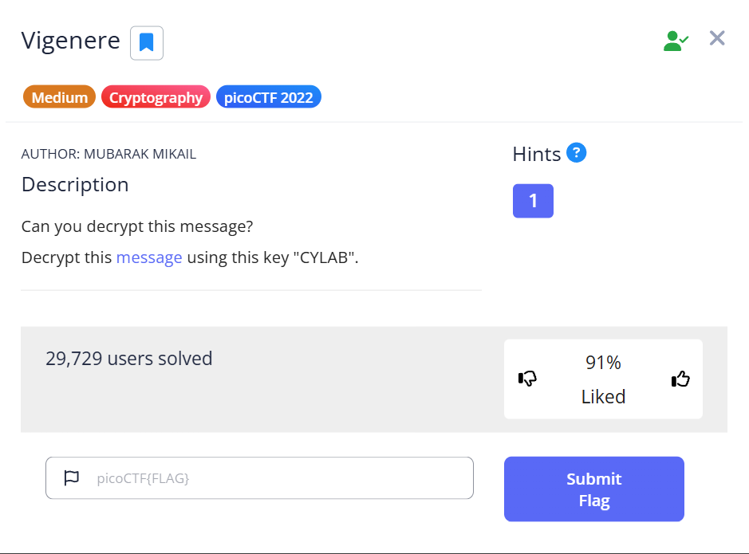
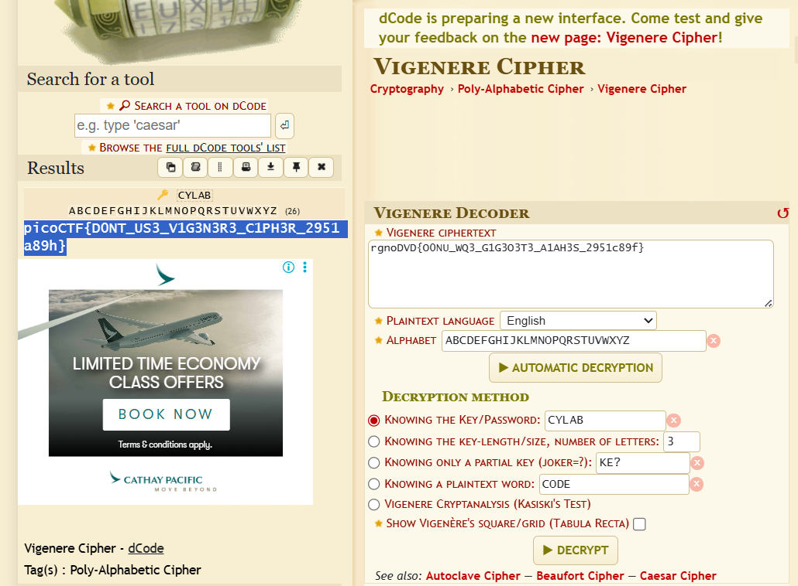

# PicoCTF 2022: Vigenere Cipher Solution
This article details the solution to the "Vigenere" cryptography challenge from PicoCTF 2022. This challenge is an excellent introduction to classical ciphers and the importance of understanding their basic principles.

The "Vigenere" challenge presents a ciphertext and a key, asking us to decrypt the message. The problem statement is straightforward: "Can you decrypt this message? Decrypt this message using this key 'CYLAB'."

# From the challenge page, we are given the following crucial pieces of information:

Ciphertext: rgno0VD{00NU_WQ3_G1G303T3_A1AH3S_2951c89f}

Key: CYLAB

Our goal is to find the plaintext, which will contain the flag in the picoCTF{FLAG} format.

# Understanding the Vigenere Cipher
The Vigenere cipher is a method of encrypting alphabetic text by using a series of different Caesar ciphers based on the letters of a keyword. It's a form of polyalphabetic substitution cipher, which makes it more robust than a simple Caesar cipher. Each letter of the plaintext is encrypted using a different Caesar cipher determined by the corresponding letter of the keyword. If the keyword is shorter than the plaintext, it is repeated.

# Solution Steps
Here is the useful website we are useing [Vigenere Cipher TOOL](https://www.dcode.fr/vigenere-cipher)
We input the ciphertext into the "VIGENERE CIPHERTEXT" field and the key "CYLAB" into the "KNOWING THE KEY/PASSWORD" field. We also ensure "Plaintext Language" is set to "English" and the "ALPHABET" is set to the standard English alphabet.

Upon clicking "DECRYPT", the tool processes the input and reveals the plaintext. The decrypted message, which contains the picoCTF flag, is:

picoCTF{DONT_US3_V1G3N3R3_C1PH3R_2951a89h}

# Conclusion
This challenge demonstrates a practical application of classical cryptography and how readily available tools can assist in their decryption. While the Vigenere cipher was considered strong in its time, modern cryptographic methods are far more complex and secure. Solving such challenges helps in understanding the foundational concepts of cryptography.
